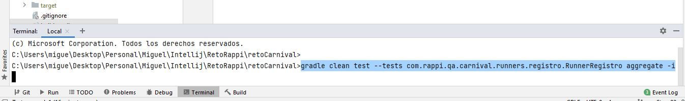
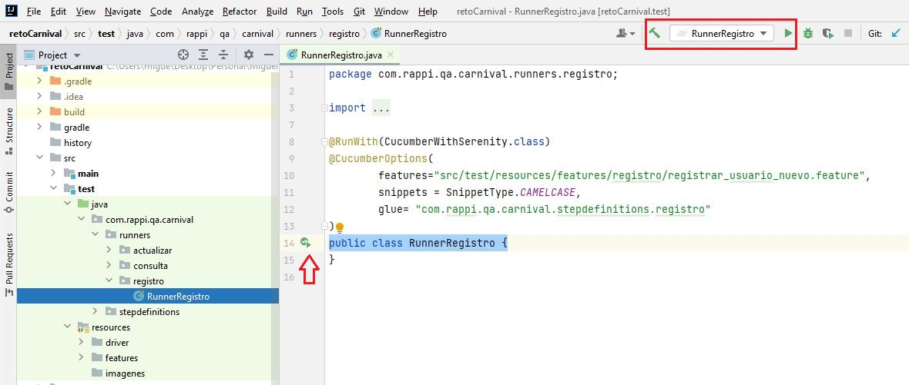

# Automatización de Pruebas para el reto Carnival
##Videos:
Se guardaron el la suta del proyecto:
+ src/test/resources/videos
### Descripción y contexto

### El framework

## BDD
Se utiliza BDD como framework de automatización para los escenarios de prueba, la idea es escribir las pruebas antes de escribir el código fuente, pero en lugar de pruebas unitarias, lo que haremos será escribir pruebas que verifiquen que el comportamiento del código es correcto desde el punto de vista de negocio. 
Tras escribir las pruebas escribimos el código fuente de la funcionalidad que haga que estas pruebas pasen correctamente. Después refactorizamos el código fuente.
partimos de historias de usuario, siguiendo el modelo “Como [rol ] quiero [ característica ] para que [los beneficios]”. 

## Gherkin
Se utiliza Gherkin como lenguaje de desarrollo de las funcionalidades dado que es un lenguaje comprensible por humanos y por ordenadores, con el vamos a definir el comportamiento de la página que vamos a automatizar.
Se trata de un lenguaje fácil de leer, fácil de entender y fácil de escribir. Utilizar Gherkin nos va a permitir crear una documentación viva a la vez que automatizamos los tests, haciéndolo además con un lenguaje que puede entender negocio.
Lo bueno de Gherkin es que para empezar a hacer BDD sólo nos hace falta conocer 5 palabras, con las que construiremos sentencias con las que vamos a describir las funcionalidades:
+ Feature: Indica el nombre de la funcionalidad que vamos a probar. Debe ser un título claro y explícito. Incluimos aquí una descripción en forma de historia de usuario: “Como [rol] quiero [característica] para que [los beneficios]”. Sobre esta descripción empezaremos a construir nuestros escenarios de prueba.
+ Scenario: Describe cada escenario que vamos a probar.
+	Given: Provee contexto para el escenario en que se va a ejecutar el test, tales como punto donde se ejecuta el test, o prerequisitos en los datos. Incluye los pasos necesarios para poner al sistema en el estado que se desea probar.
+	When: Especifica el conjunto de acciones que lanzan el test. La interacción del usuario que acciona la funcionalidad que deseamos testear.

+	Then: Especifica el resultado esperado en el test. Observamos los cambios en el sistema y vemos si son los deseados.
Lo normal es probar distintos escenarios para comprobar una determinada funcionalidad. 
De esta forma vamos a pasar de nuestras historias de usuario a pruebas de comportamiento automatizables.

##Cucumber
Se utiliza cucumber como herramienta para para automatizar las pruebas en BDD. Cucumber nos va permitir ejecutar descripciones funcionales en texto plano como pruebas de software automatizadas. Totalmente compatible con el lenguaje Gherkin.

###Compilador

Se crea el proyecto sobre Gradle, es una herramienta de automatización de la construcción de nuestro código, es la versión mejorada de Maven, pero intenta llevarlo todo un paso más allá. Para empezar, se apoya en Groovy y en un DSL (Domain Specific Language) para trabajar con un lenguaje sencillo y claro a la hora de construir el build comparado con Maven. Por otro lado, dispone de una gran flexibilidad que permite trabajar con ella utilizando otros lenguajes y no solo Java. 
Dispone por otro lado de un sistema de gestión de dependencias sólido.

###Patrones de desarrollo
Para el desarrollo de la automatización se utilizaron los siguientes patrones de desarrollo:

+ Variables: camelCase
+ Funciones: camelCase
+ Clases: PascalCase
+ Paquetes: camelCase

Camel Case: El nombre viene porque se asemeja a las dos jorobas de un camello, y se puede dividir en dos tipos:
+ Upper Camel Case, cuando la primera letra de cada una de las palabras es mayúscula. También denominado Pascal Case. Ejemplo: EjemploDeNomenclatura.
+ Lower Camel Case, igual que la anterior con la excepción de que la primera letra es minúscula. Ejemplo: ejemploDeNomenclatura.
Es muy usada en los #hashTags de Twitter o en lenguajes como Java, PHP, C#…

###Prácticas de automatización

Un proyecto donde se ejemplifica el uso del patrón serenity
[screenplay](http://thucydides.info/docs/serenity-staging/#_serenity_and_the_screenplay_pattern) con cucumber y gradle.

Los tests usan tareas (tasks), interacciones (interactions), preguntas (questions), elementos de páginas (user_interface) y basicamente se tiene la siguiente estructura a nivel de proyecto de automatización.

+ tasks
    Clases que representan tareas que realiza el actor a nivel de proceso de negocio
+ interacion
    Clases que representan las interacciones directas con la interfaz de usuario
+ user_interface
    Page Objects y Page Elements. Mapean los objetos de la interfaz de usuario
+ questions
    Objectos usados para consultar acerca del estado de la aplicación

###Herramienta de automatización utilizado

Se utiliza el IDE de Eclipse para el desarrollo de la automatización. Eclipse es una plataforma de desarrollo, diseñada para ser extendida de forma indefinida a través de plug-ins. Fue concebida desde sus orígenes para convertirse en una plataforma de integración de herramientas de desarrollo. No tiene en mente un lenguaje específico, sino que es un IDE genérico, aunque goza de mucha 
popularidad entre la comunidad de desarrolladores del lenguaje Java usando el plug-in JDT que viene incluido en la distribución estándar del IDE.
Proporciona herramientas para la gestión de espacios de trabajo, escribir, desplegar, ejecutar y depurar aplicaciones.

###Estrategia de automatización

Inicialmente se levantaron los flujos de cada transacción, para conocer el negocio y tener claro que se debia automatizar.
Una vez claro el alcance se procede con la automatización de las transacciones, para esto se decide automatizar por capas front y iseries.

El front es proporcionado por TODO1, y el Backend es desarrollado por el Banco.

Para correr el proyecto se necesita Java JDK 1.8 y Gradle preferiblemente con la versión 6.7.

##Comando para ejecutar desde consola:

###Comandos desde Gradle:
####Ejecuto el Runner Registro Usuario:
+ gradle clean test --tests com.rappi.qa.carnival.runners.registro.RunnerRegistro aggregate -i
####Ejecuto el Runner Consulta Buscar Crucero:
+ gradle clean test --tests com.rappi.qa.carnival.runners.consulta.RunnerBuscarCrucero aggregate -i
####Ejecuto el Runner Actualizar un crucero:
+ gradle clean test --tests com.rappi.qa.carnival.runners.actualizar.RunnerActualizarBusqueda aggregate -i

##Ejecutar desde la Clase Runner

####Los runners se encuentra en la siguientes rutas del proyecto:
+ src/test/java/com/rappi/qa/carnival/runners/registro/RunnerRegistro.java
+ src/test/java/com/rappi/qa/carnival/runners/consulta/RunnerBuscarCrucero.java
+ src/test/java/com/rappi/qa/carnival/runners/actualizar/RunnerActualizarBusqueda.java